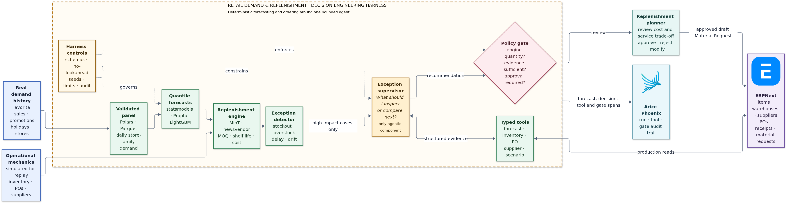

# Retail Demand & Replenishment Decision System — Technical Architecture

## Purpose

The system converts uncertain demand into coherent forecasts and cost-aware
order recommendations. One central agent investigates only high-impact
exceptions; the forecasting and replenishment engines remain deterministic.

## The 90-second explanation

1. Real Favorita demand is cleaned into a reproducible daily store-family panel.
2. Models produce demand quantiles at different hierarchy levels; MinT makes
   the forecasts add up across store, family, and total.
3. The replenishment engine combines forecast uncertainty with inventory,
   supplier lead time, MOQ, shelf life, and shortage/overage costs.
4. Deterministic rules send only unusual or expensive cases to one exception
   supervisor.
5. The supervisor gathers typed evidence and compares scenarios calculated by
   the engine. It never invents an order quantity.
6. A replenishment planner approves the recommendation. In production, the
   approved proposal becomes a draft Material Request in ERPNext.

The design rule is: **models estimate uncertainty, code calculates valid order
quantities, and the agent explains exceptions that require judgement.**

## Core responsibilities

| Component | Responsibility |
|---|---|
| Data panel | Validate calendar, launches, zeros, promotions, and hierarchy keys |
| Forecasting layer | Produce point and quantile forecasts without future leakage |
| MinT reconciliation | Keep forecasts coherent across every hierarchy level |
| Replenishment engine | Calculate valid quantities and cost/service trade-offs |
| Exception detector | Identify stockout, overstock, supplier, data, and drift risks |
| Exception supervisor | Select evidence and engine-approved scenarios to inspect |
| Policy gate | Enforce evidence, quantity provenance, authorization, and approval |
| ERPNext | Hold items, warehouses, suppliers, purchase orders, and receipts |
| Replenishment planner | Approve, reject, or modify proposed action |

## ERPNext integration and persona

The main user is a **central or regional replenishment planner**. A procurement
buyer handles supplier escalation; store teams resolve local stock discrepancies.

The service uses Frappe's authenticated REST API. It reads Items, Warehouses,
inventory, Suppliers, Purchase Orders, and Purchase Receipts. After planner
approval, it creates a **draft Material Request**. ERPNext remains the system of
record and owns the normal purchase-order authorization flow. The agent never
writes directly to the ERP database.

## Historical replay

Hide the final 8–12 weeks of real demand and simulate the operational mechanics
around it: opening inventory, open POs, receipts, supplier delays, MOQ, pack
sizes, shelf life, and costs. Replay the period chronologically with no future
leakage and identical random seeds.

| Comparison | Behaviour |
|---|---|
| Static | Forecast once and follow a fixed policy |
| Dynamic deterministic | Reforecast and recompute orders on schedule |
| Dynamic agentic | Use the same engine plus exception investigation and approved actions |

Report fill rate, stockouts, spoilage, average inventory, working capital,
expedite cost, markdown cost, and total cost. Agent value is only the incremental
gain over the dynamic deterministic baseline.

## Open-source stack

| Layer | Technology | Status |
|---|---|---|
| Data and artifacts | Python, Polars, pandas, Parquet | Implemented |
| Statistical forecasting | statsmodels/SARIMAX | Planned |
| Mid-level forecasting | Prophet | Planned |
| Bottom-level quantiles | LightGBM | Planned |
| Reconciliation and policies | NumPy, MinT-shrink, newsvendor policies | Planned |
| API and contracts | FastAPI, Pydantic | Planned |
| Agent runtime | LangGraph, one bounded supervisor | Future extension |
| ERP | ERPNext/Frappe REST API | Future integration |
| Tracing | OpenTelemetry, Arize Phoenix | Future extension |
| Local infrastructure | Docker Compose, PostgreSQL | Planned |

## Current status

Implemented today: data contracts, validators, a reproducible daily panel, and
time-series EDA. Forecasting, reconciliation, inventory simulation,
replenishment policies, replay evaluation, ERPNext integration, and the agentic
extension follow the phase-gated roadmap.
